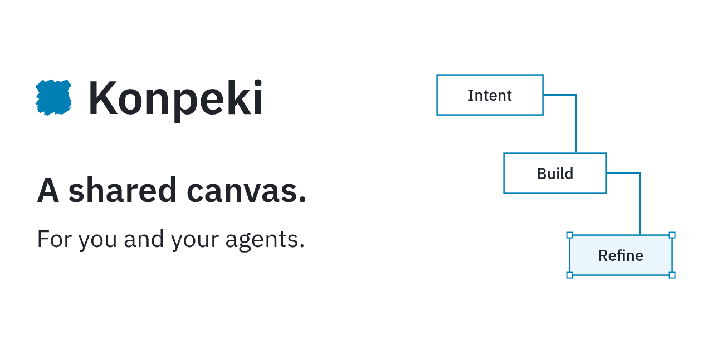

**Create clear visuals with your coding agent.** Konpeki is an opinionated design
framework for covers, social graphics, visual explanations and presentations.

Give your coding agent notes, source material and a brief. Konpeki provides the
canvas, design guidance, typography and semantic components for the intended
format and dimensions.

People and agents edit the same composition. Export a page as PNG, download its
editable JSON, or use **Present** for a chrome-free presentation.

## Use with your agent

Requires **Node.js 24+**, npm, a coding agent that can edit files and run commands,
and a browser.

Install the [Konpeki skill](skills/konpeki/) with your agent's
skill installer. Install the whole directory, including `scripts/` and `assets/`, not just
`SKILL.md`. For example, ask a Codex skill installer:

```text
Install the konpeki skill from vcfgdev/konpeki, at skills/konpeki.
```

Then choose a mode, or just give it a brief:

| Workflow | Codex CLI / IDE | Claude Code standalone skill |
| --- | --- | --- |
| Open a blank or existing editor; no generation | `$konpeki init` | `/konpeki init` |
| Create, inspect and revise a visual | `$konpeki generate …` | `/konpeki generate …` |

`init` accepts a composition JSON path and preserves existing work. `generate`
uses the materials already in your conversation and prepares the runtime if
needed; there is no required init step. Plugin installations may namespace the
skill. Other hosts can select the skill or use natural language:

> Use Konpeki to turn these launch notes into a product announcement.

Or ask for an article cover, a social graphic, a chart, a diagram or a presentation.
Natural-language creation requests select `generate` automatically.
The skill reuses a compatible runtime or, with permission, installs the pinned
npm release in a user cache. It creates editable JSON in your workspace, opens
the preview and visually checks the result. You do not need to clone Konpeki,
edit a package manifest, or repeat your prompt in a blank canvas.

First-run installation, browser permissions and remote preview forwarding depend
on your agent host. If skills are unavailable, give the agent the public
[SETUP.md](https://raw.githubusercontent.com/vcfgdev/konpeki/main/SETUP.md) URL and
your brief together. The setup guide also covers the optional Codex plugin package.

Ask for revisions in the same conversation. Add “Stop after the outline for
approval” when you want a checkpoint. Supply a visual direction or leave it open;
[authoring modes](AUTHORING.md#authoring-mode) provide defaults without requiring
you to choose fonts, colors or layouts first.

Canvas review notes use **Build it** and an active agent listener, or the
button's copyable handoff to resume the agent. Opening the editor alone does not
connect or wake an agent. The skill modes are not terminal CLI subcommands.

## Manual npm start

For a manual start, install [Konpeki from npm](https://www.npmjs.com/package/konpeki)
in your workspace (run `npm init -y` first in a new, empty directory):

```sh
npm install --save-dev konpeki@latest
curl -fL https://raw.githubusercontent.com/vcfgdev/konpeki/main/slides/introducing-konpeki/composition.json -o introduction.json
npm exec --no -- konpeki preview introduction.json
```

Open the exact URL printed by `preview`. Browser edits save to your downloaded file;
valid agent edits appear on the same canvas. In a remote environment, use its
authenticated preview mechanism rather than sharing a local address.

## Examples and guides

- [Example gallery](slides/README.md): 18 fictional examples and an editable
  Konpeki introduction. Retained React/SVG examples are drawing references;
  new editable documents use composition JSON.
- [Agent-led setup](SETUP.md) and [authoring guidance](AUTHORING.md).
- [Canvas workflow](docs/workflow.md): page sizes, export and agent handoff.
- [Development](docs/development.md): architecture, demo hosting, packaging and checks.
- [Composition contract](composition/README.md) and [design resources](design/README.md).
- [Contributing](CONTRIBUTING.md) and [security policy](SECURITY.md).

Konpeki requires no account or hosted AI service. Your coding agent's pricing
and data handling still apply. Supply facts and approved assets; examples and
component placeholders are not evidence about real products.

## License

[Apache-2.0](LICENSE). Dependencies and bundled fonts retain their own licenses;
external design references are credited where used.
