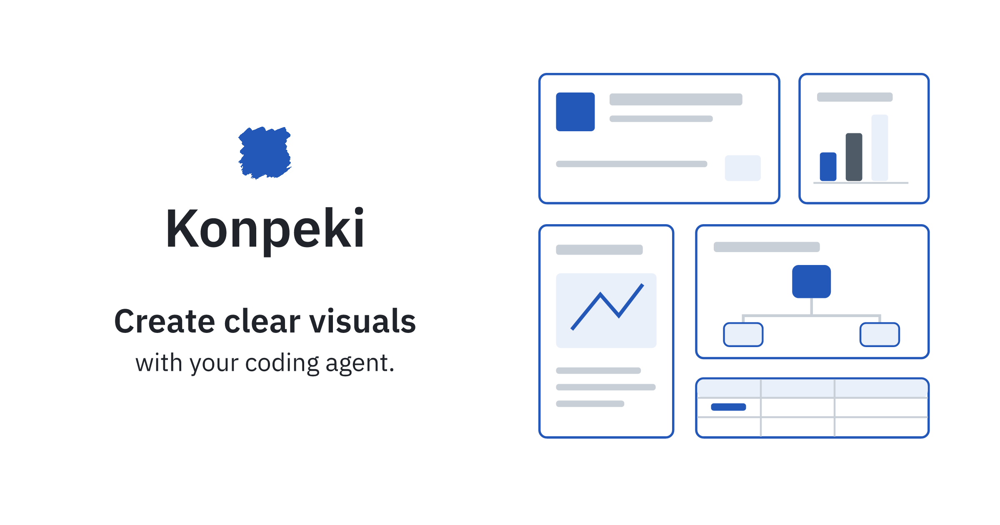
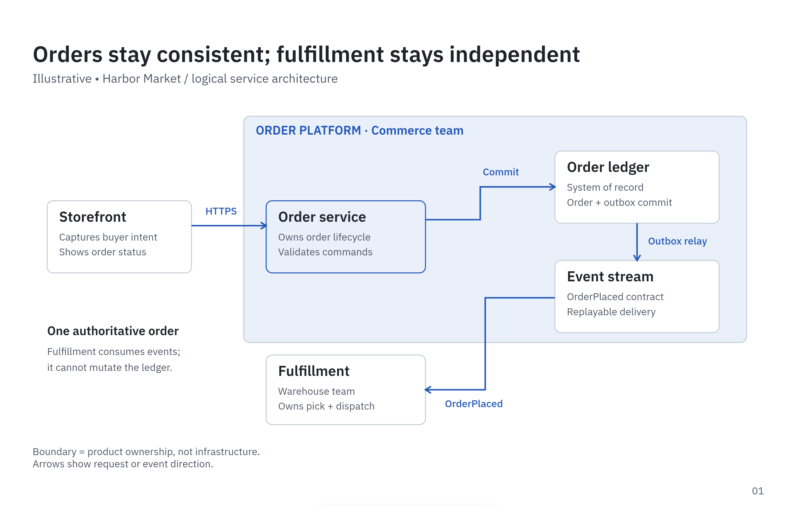
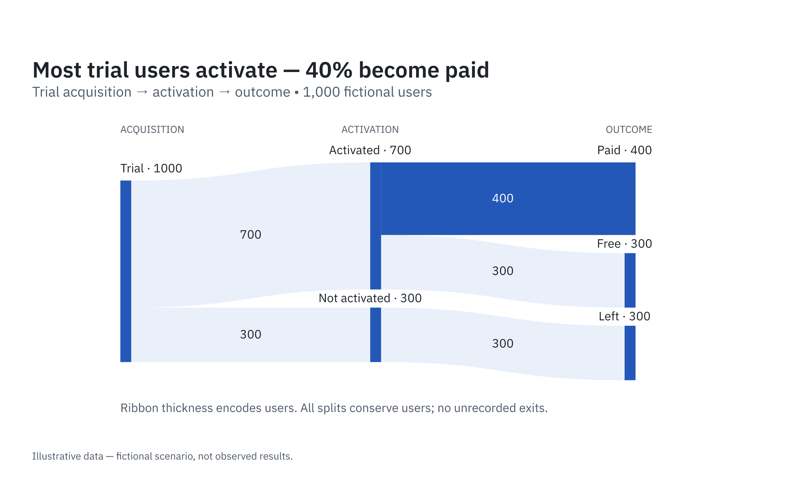
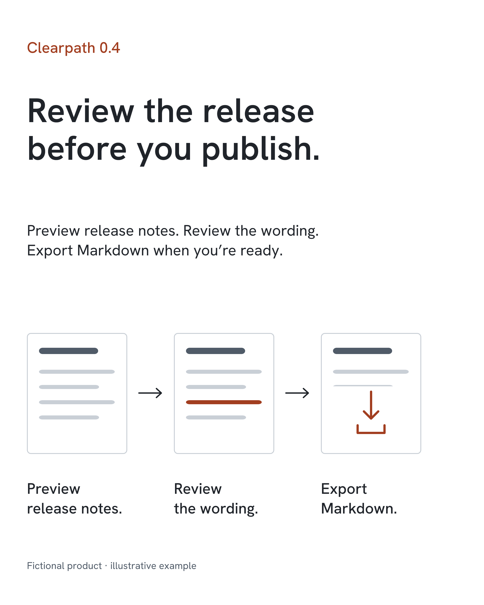
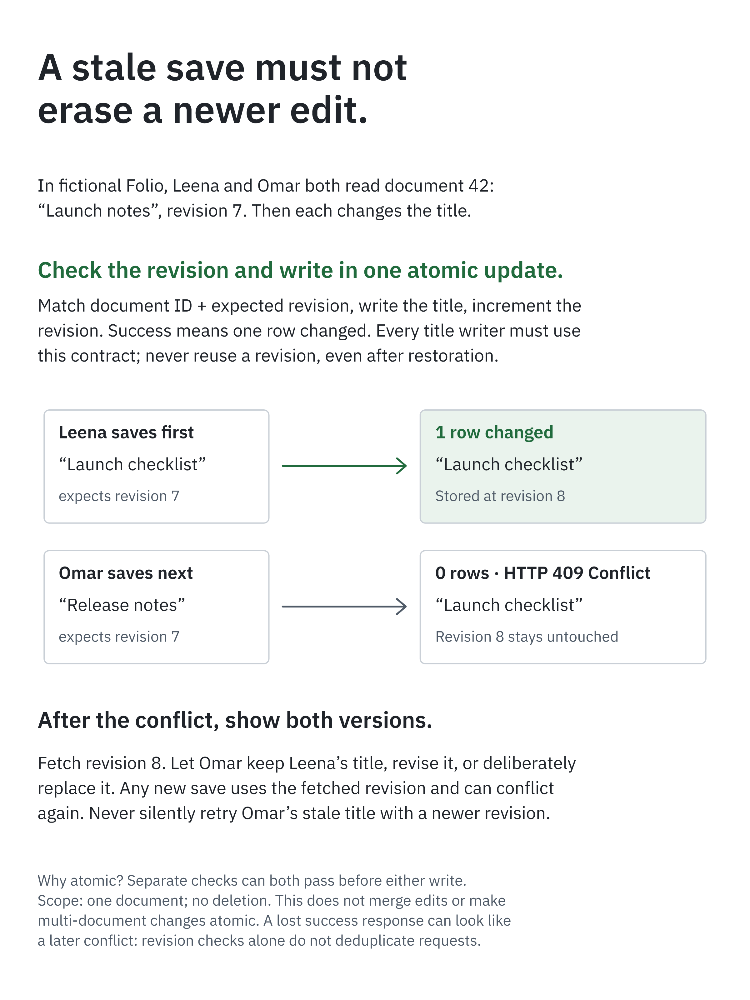

**Create finished visuals with your coding agent.** Konpeki combines a concise
design direction, its own rendering engine, and editable source for covers,
social graphics, visual explanations and presentations.

Give your coding agent source material and a brief. It authors a finished visual
with editable source and requested exports. If a correction is useful, edit basic
canvas text or leave comments that combine communication intent with specific
revision requests, then copy the prompt and paste it into the agent conversation.

People and agents edit the same v2 composition. The owned scene drives preview,
checks, and PNG/SVG/PDF output.

## Use with your agent

Requires **Node.js 24+**, npm, and a coding agent that can edit files and run
commands. A browser is optional for review and basic corrections.

Install once, choosing your agent when prompted:

```sh
npx skills add vcfgdev/konpeki -g
```

Start a new conversation or reload your agent's skills. **Send this to your agent:**

> Use Konpeki to create a one-page explainer of how a browser, API and database work together.

Replace the example with your own brief and materials. Your agent prepares the
runtime, creates editable JSON in your workspace, checks it, renders a 2x PNG,
and inspects the result. A browser preview is optional. First use may require
installation permission.

Keep revisions in the same conversation. The browser does not require a content
or intent form, or ask people to choose diagram or chart types. Optional basic
text corrections remain in the composition. **Copy & clear** copies pending
comments with their target IDs and clears the copied batch, with **Undo**;
paste the prompt into your agent. Comments stay local
to the browser and never invoke an agent or require a review sidecar. File-session
composition edits still use revision-checked saves. See
[setup details](SETUP.md) for other install methods.

## Try the editor in your browser

[Open the editable Konpeki example](https://vcfgdev.github.io/konpeki/?example=introducing-konpeki).

The browser-only playground lets you review and comment on an example, move,
resize, delete, correct text, keep a local working copy, import/download editable
JSON, and copy feedback as a prompt. All pages share a canvas with arrows
showing their order. The bottom-right button starts target selection, or opens
the queue when comments already exist. Select a canvas target, write feedback,
and **Add** to open the compact queue. Use **New comment** to select another
target, the pencil to edit feedback, or **Copy & clear** to hand it off.
Click the comment button again or press Escape to close. There are no sidebars or toolbars.
Use the CLI for PNG/SVG/PDF exports. It requires
no account or AI service. Browser-local data is not cloud backup; download JSON
and copy pending comments before moving or clearing your work. Share the latest
JSON with your agent when it does not already have the source.

The playground does not connect to an agent. The agent-led workflow above is the
route from a prompt to a checked and visually inspected composition.

## Showcase

Illustrative examples with editable text and vector artwork. Click a preview to
view it full-size, or download its JSON and drop it onto the canvas in the
[playground](https://vcfgdev.github.io/konpeki/).

<table>
  <tr>
    <td width="50%" align="center" valign="top">
      <a href="slides/gallery/architecture.png"></a><br>
      <strong>Explain a system</strong><br>
      Order handling, events and fulfillment<br>
      <a href="slides/gallery/architecture.json">Editable JSON</a>
    </td>
    <td width="50%" align="center" valign="top">
      <a href="slides/gallery/sankey.png"></a><br>
      <strong>Communicate data</strong><br>
      Trial users, activation and outcomes<br>
      <a href="slides/gallery/sankey.json">Editable JSON</a>
    </td>
  </tr>
  <tr>
    <td width="50%" align="center" valign="top">
      <a href="slides/gallery/release.png"></a><br>
      <strong>Announce a release</strong><br>
      A portrait social graphic for Clearpath<br>
      <a href="slides/gallery/release.json">Editable JSON</a>
    </td>
    <td width="50%" align="center" valign="top">
      <a href="slides/gallery/explainer.png"></a><br>
      <strong>Teach a concept</strong><br>
      One-page guide to preventing stale saves<br>
      <a href="slides/gallery/explainer.json">Editable JSON</a>
    </td>
  </tr>
</table>

[Browse the gallery](slides/README.md) for briefs, sources and more examples.

## Manual npm start

For a manual start, install [Konpeki from npm](https://www.npmjs.com/package/konpeki)
in your workspace (run `npm init -y` first in a new, empty directory):

```sh
npm install --save-dev konpeki@latest
curl -fL https://raw.githubusercontent.com/vcfgdev/konpeki/main/slides/introducing-konpeki/composition.json -o introduction.json
npm exec --no -- konpeki preview introduction.json
```

Open the exact URL printed by `preview`. Browser edits save to your downloaded file;
valid agent edits appear on the same canvas. In a remote environment, use its
authenticated preview mechanism rather than sharing a local address.

## Examples and guides

- [Native example gallery](slides/README.md): editable diagrams, data graphics,
  a social announcement and a one-page explainer, plus the product introduction
  and repository cover. Older React/SVG drawing references remain separate.
- [Agent-led setup](SETUP.md) and [authoring guidance](AUTHORING.md).
- [Canvas workflow](docs/workflow.md): page sizes, export and agent handoff.
- [Development](docs/development.md): architecture, demo hosting, packaging and checks.
- [Composition contract](composition/README.md) and [design resources](design/README.md).
- [Contributing](CONTRIBUTING.md) and [security policy](SECURITY.md).

Konpeki requires no account or hosted AI service. Your coding agent's pricing
and data handling still apply. Supply facts and approved assets; examples and
component placeholders are not evidence about real products.

## License

[Apache-2.0](LICENSE). Dependencies and bundled fonts retain their own licenses;
external design references are credited where used.
