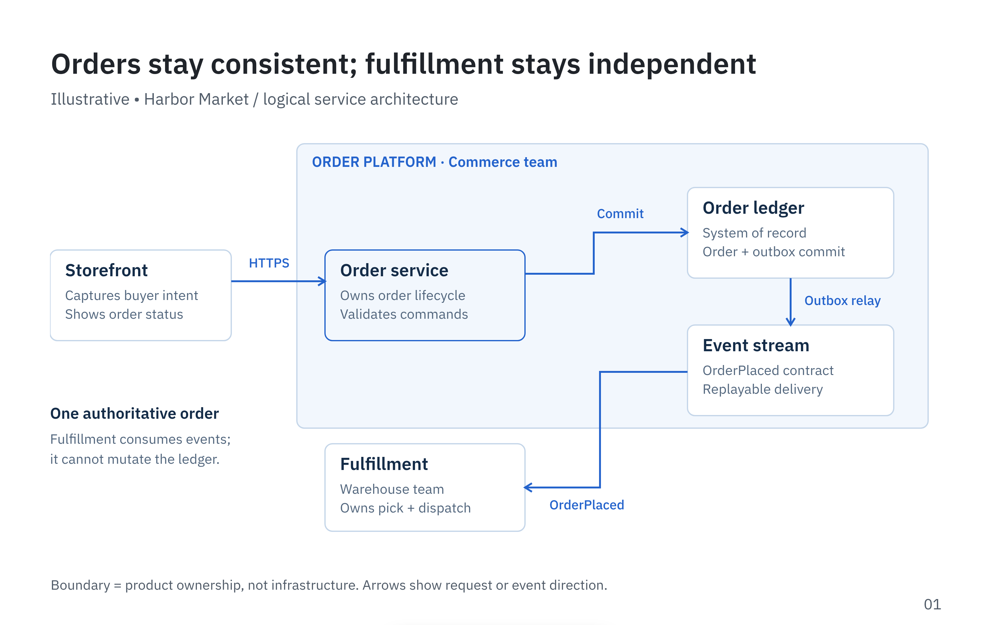
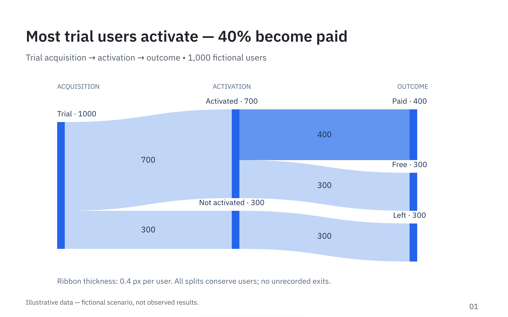
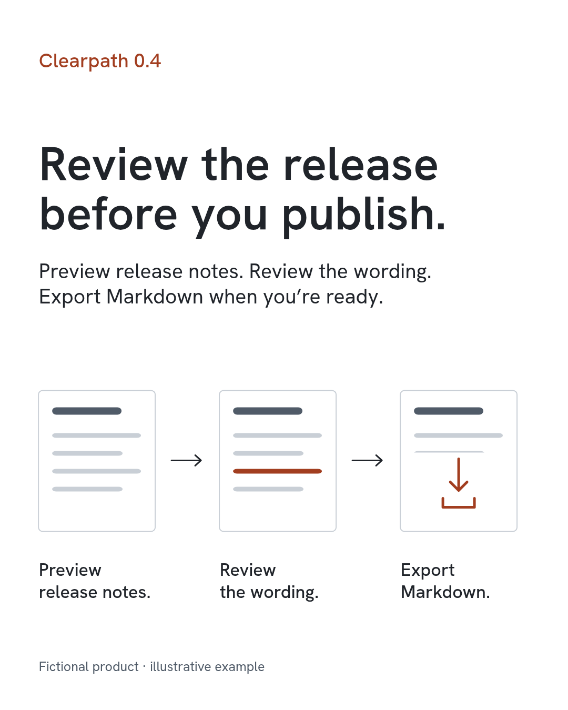
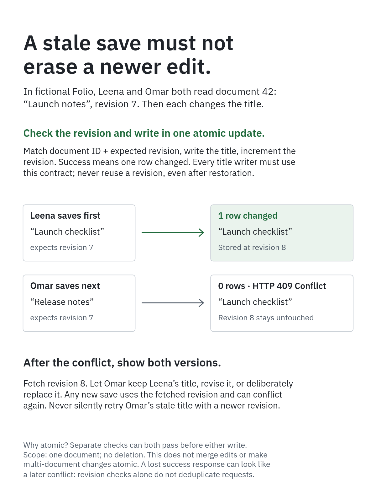

# What can I make with Konpeki?

Reviewed examples with editable text and vector artwork. Scenarios and data
are illustrative; these are finished documents, not one-click templates.

Download an example's JSON and choose **Demo Mode → Import** in the
[playground](https://vcfgdev.github.io/konpeki/). For revision notes and agent
handoff, open it in a [file-backed preview](../docs/workflow.md#file-backed-editing-with-an-agent).
Playground edits stay in your browser.

## Explain a system

An order platform's request handling, data, events and fulfillment.

[Editable JSON](gallery/architecture.json) ·
[Brief](gallery/PROMPT.md#architecture) · [Source](gallery/SOURCE.md#architecture)

## Communicate data

A proportional Sankey follows 1,000 trial users through activation and outcomes.

[Editable JSON](gallery/sankey.json) ·
[Brief](gallery/PROMPT.md#sankey) · [Source](gallery/SOURCE.md#sankey)

## Announce a release

A 1080×1350 Clearpath release announcement: preview, review and export Markdown.

[Editable JSON](gallery/release.json) ·
[Brief](gallery/PROMPT.md#release) · [Source](gallery/SOURCE.md#release)

## Teach a concept

A 1200×1600 Folio explainer shows a stale save, its rejection and recovery choices.

[Editable JSON](gallery/explainer.json) ·
[Brief](gallery/PROMPT.md#explainer) · [Source](gallery/SOURCE.md#explainer)

## More examples

- [Introducing Konpeki](introducing-konpeki/README.md): six-page product overview.
- [Repository cover](github-cover/README.md): 1280×640 social preview.
- [React/SVG drawing references](drawing-references.md): 18 older examples, not editor-importable documents.

These four gallery exports are repository-only; their authoring projects are
maintained separately. They are not bundled in npm or the hosted playground.
The introduction and cover JSONs are included in npm; the playground bundles
the introduction. View this gallery in the repository for its screenshots.
