# Decks and examples

The image gallery below is for the repository checkout. The npm package includes
editable examples and prompts but omits gallery PNGs; view this page and its
screenshots in the repository, or render the source locally.

## Introducing Konpeki

[Introducing Konpeki](introducing-konpeki/README.md) is a six-slide factual product
introduction authored in the shared canvas's editable composition format.
Open `?example=introducing-konpeki` in the running application, or download
its [composition JSON](introducing-konpeki/composition.json) and use **Open**.

## Retained drawing references

Each retained example contains its approved `PROMPT.md`, editable `index.tsx`, and final
PNGs in `screenshots/`. Generation logs, environment records, review reports and
superseded captures are not included. Subjects and datasets in these retained
references are fictional; they are not another presentation runtime.

## Representative charts

### Line chart — Tide, page 1

Two time series on a shared scale, direct labels, a target line, an event marker
and an explicit gap for missing data. [Editable source](line-chart/index.tsx).

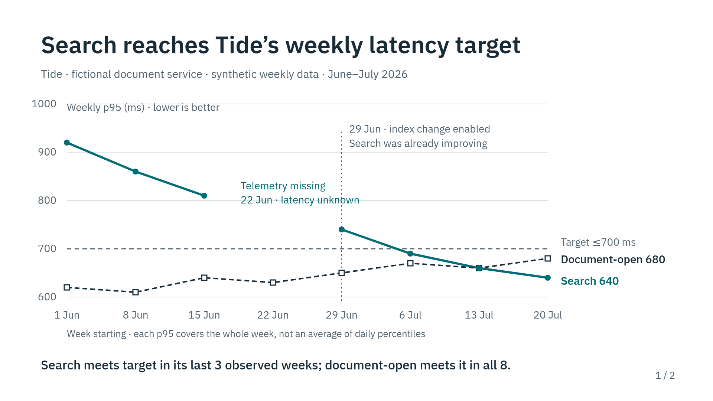

### Grouped bar chart — Birch, page 1

Horizontal before/after bars with a shared zero baseline and direct values.
[Editable source](bar-chart/index.tsx).

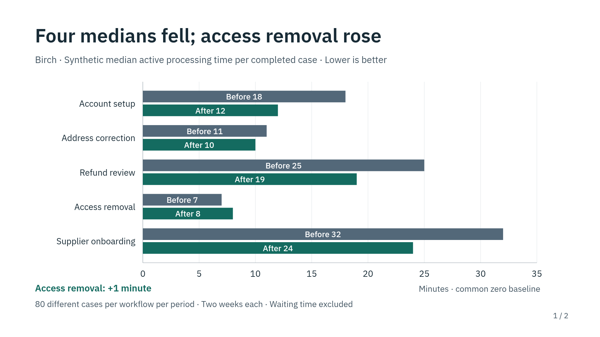

### Vertical bar chart — Fieldnote, page 1

Zero-based columns compare processing throughput with direct values.
[Editable source](vertical-bar-charts/index.tsx).

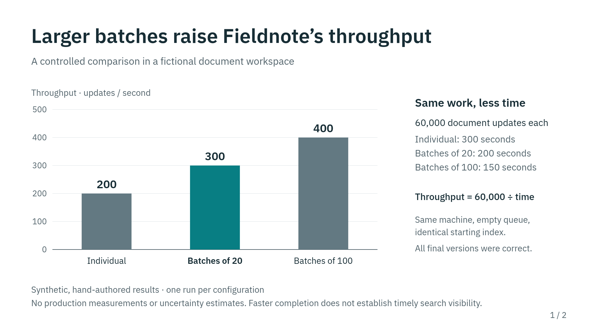

### Two charts side by side — Fieldnote, page 2

Throughput on the left and visibility delay on the right show the trade-off,
with separate units, zero-based scales and acceptance thresholds.
[Editable source](vertical-bar-charts/index.tsx).

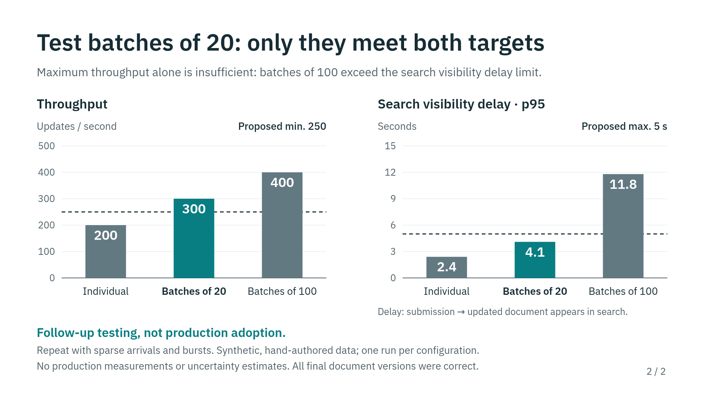

### Stacked bar chart — Fern, page 1

Direct-count segments compare completion before and after a hint, with the same
denominator for every task. [Editable source](research-brief/index.tsx).

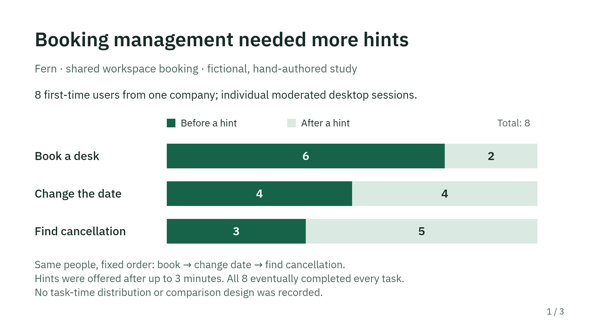

## Representative content layouts

### Two columns — Fern, page 2

Parallel columns separate observed evidence from researchers' interpretations.
[Editable source](research-brief/index.tsx).

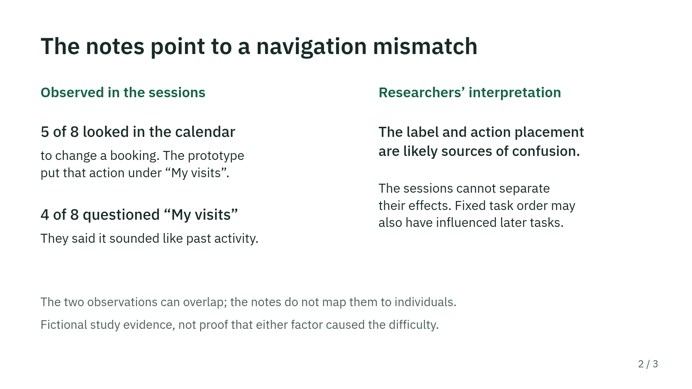

### Three columns — Lantern, page 2

Three aligned time-based columns distinguish rollback, partial recovery and
backlog clearance. [Editable source](incident-workflow/index.tsx).

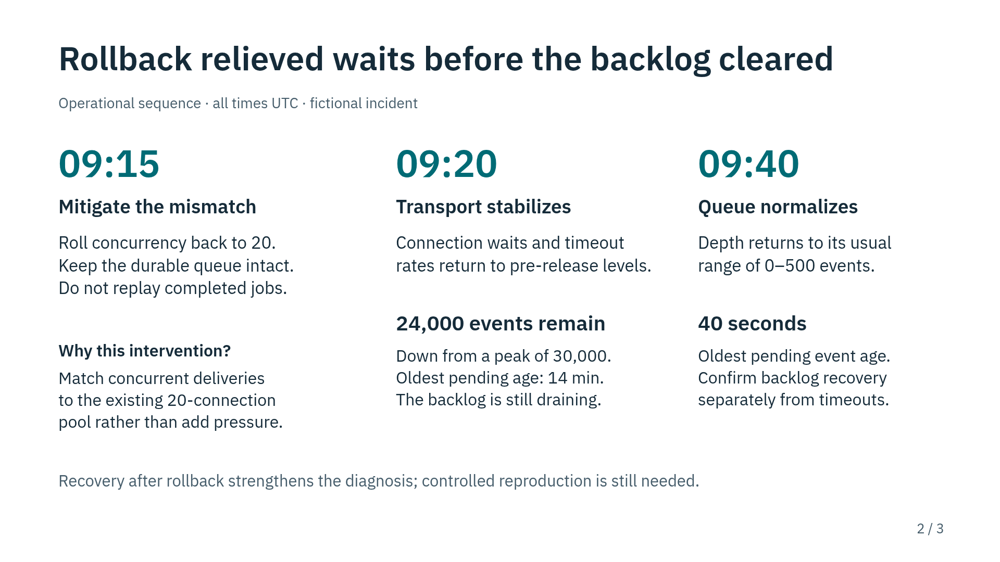

### Main panel and sidebar — Patchnote, page 2

A large illustrative draft panel pairs with a narrower human-review checklist.
[Editable source](product-introduction/index.tsx).

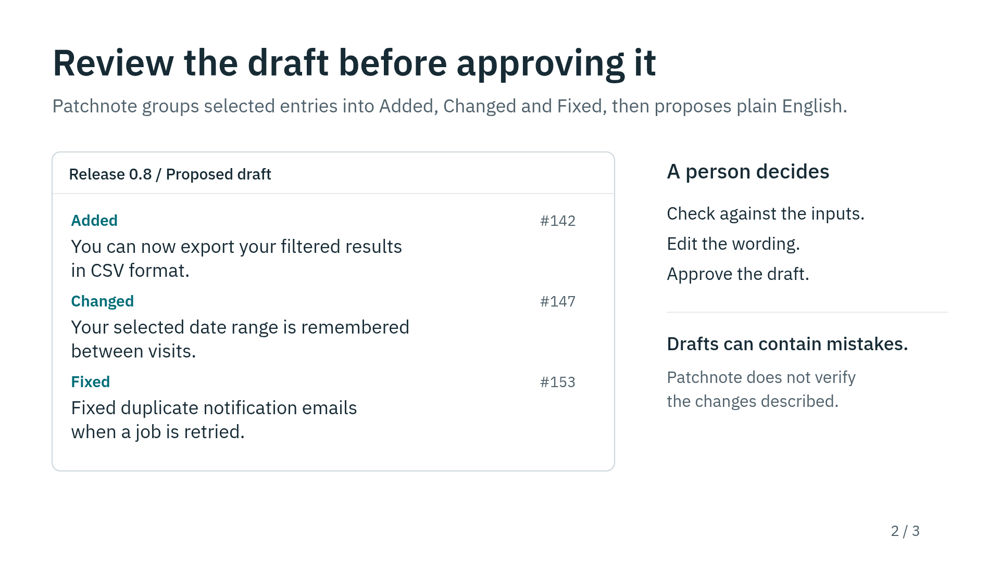

## Representative diagrams and structured information

### Architecture diagram — Parcel Relay, page 1

Named components and attached connectors explain acceptance and delivery.
[Editable source](architecture/index.tsx).

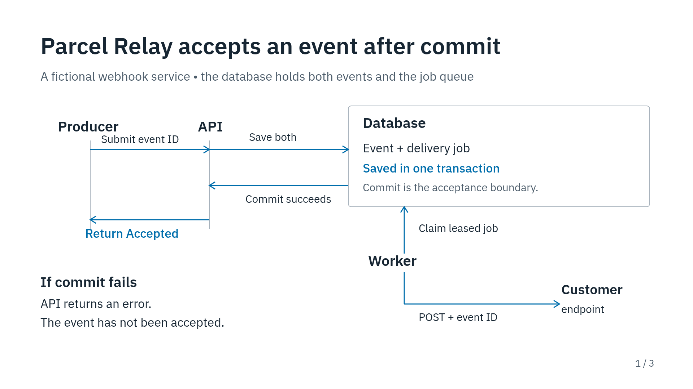

### Sequence diagram — Parcel Relay, page 3

Two participant lifelines show a lost response and retry of the same event.
[Editable source](architecture/index.tsx).

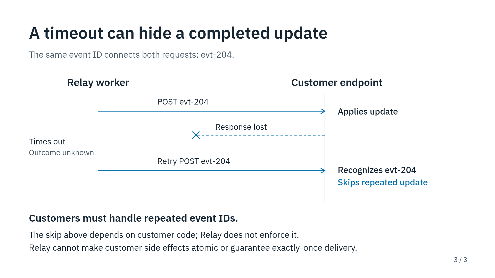

### Gantt chart — Harbor, page 1

A shared calendar axis compares baseline, completed and forecast work, with
dependencies and release gates. [Editable source](delivery-plan/index.tsx).

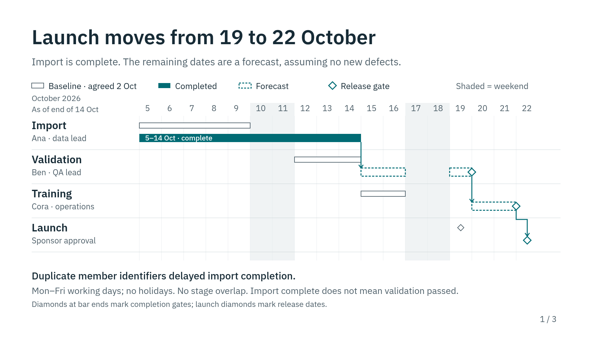

### Sankey chart — Brook, page 1

Proportional flows carry 120 tickets from intake through handling to outcomes,
with direct counts and conservation at each stage.
[Editable source](sankey/index.tsx).

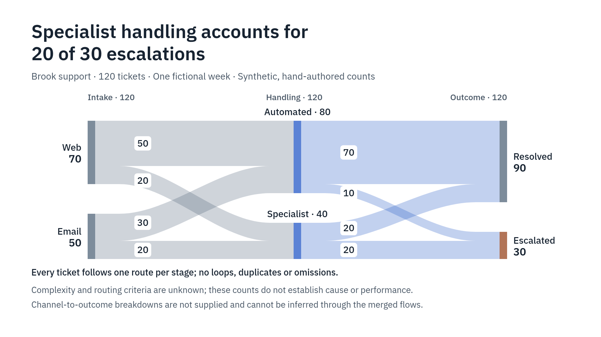

### Evidence table — Harbor, page 2

Aligned stage–evidence rows use horizontal rules to make gate requirements easy
to compare. [Editable source](delivery-plan/index.tsx).

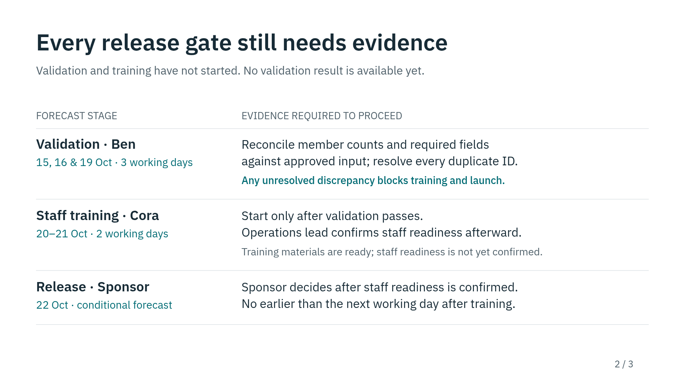

## All examples

The selections above demonstrate distinct visual patterns rather than ranking
decks. All final screenshots remain available below.

| Example | Prompt | Final screenshots |
| --- | --- | --- |
| Patchnote — product introduction | [Prompt](product-introduction/PROMPT.md) | [Images](product-introduction/screenshots/) |
| Parcel Relay — architecture | [Prompt](architecture/PROMPT.md) | [Images](architecture/screenshots/) |
| Fieldnote — experiment | [Prompt](experiment/PROMPT.md) | [Images](experiment/screenshots/) |
| Lantern — incident workflow | [Prompt](incident-workflow/PROMPT.md) | [Images](incident-workflow/screenshots/) |
| Moss — comparison | [Prompt](comparison/PROMPT.md) | [Images](comparison/screenshots/) |
| Juniper — migration | [Prompt](migration/PROMPT.md) | [Images](migration/screenshots/) |
| Clearpath — OG images | [Prompt](og-images/PROMPT.md) | [Images](og-images/screenshots/) |
| Alder — article briefing | [Prompt](article-brief/PROMPT.md) | [Images](article-brief/screenshots/) |
| Waymark — results explanation | [Prompt](results-explanation/PROMPT.md) | [Images](results-explanation/screenshots/) |
| Dockline — retrospective | [Prompt](retrospective/PROMPT.md) | [Images](retrospective/screenshots/) |
| Fern — research briefing | [Prompt](research-brief/PROMPT.md) | [Images](research-brief/screenshots/) |
| Cedar Support — decision memo | [Prompt](decision-memo/PROMPT.md) | [Images](decision-memo/screenshots/) |
| Harbor — delivery plan | [Prompt](delivery-plan/PROMPT.md) | [Images](delivery-plan/screenshots/) |
| Folio — teaching | [Prompt](teaching/PROMPT.md) | [Images](teaching/screenshots/) |
| Tide — line chart | [Prompt](line-chart/PROMPT.md) | [Images](line-chart/screenshots/) |
| Birch — bar chart | [Prompt](bar-chart/PROMPT.md) | [Images](bar-chart/screenshots/) |
| Fieldnote — vertical and paired bar charts | [Prompt](vertical-bar-charts/PROMPT.md) | [Images](vertical-bar-charts/screenshots/) |
| Brook — Sankey chart | [Prompt](sankey/PROMPT.md) | [Images](sankey/screenshots/) |

The `index.tsx` files are retained presentation-runtime-independent React/SVG
drawing references, not runnable routes or a second deck format. Agents can
inspect and adapt their techniques, then convert supported SVG primitives into
editable vector elements in the owning composition component.
Shared authoring resources live in `design/` and `lib/`.

Screenshots reflect the final reviewed browser renders, including manual repairs.
They do not establish PDF/PPTX, cross-browser or cross-application fidelity.
