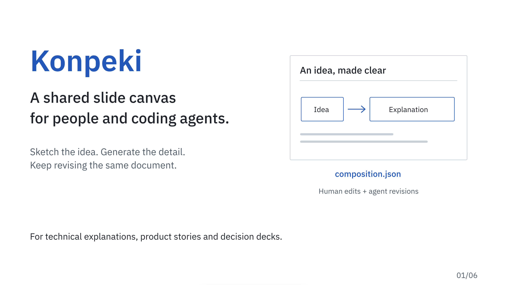

# Introducing Konpeki

A six-slide English introduction for first-time users. Defaults to Plex on paper
with theme-linked colors and fonts; deck appearance can switch palettes and
Paper/Night without repainting vector elements. Uses the default authoring mode.

1. **Meet Konpeki** — one shared canvas for people and coding agents.
2. **A round-trip workflow** — draft, download, agent revision, open and present.
3. **Five semantic components** — Text block, Diagram, Chart, Image and Table.
4. **Keep the detail editable** — stable vector elements inside their owners.
5. **What works today** — capabilities alongside practical boundaries.
6. **Try a real brief** — setup and an example request.

## Open and revise

Run `pnpm dev` from the repository root and open
`?example=introducing-konpeki` in the application. Select **Present** for viewing.
The example preview does not autosave: use **Download** to keep changes, then
**Open** the saved JSON from the ordinary canvas for browser-local autosave.

[composition.json](composition.json) is the authoritative editable deck. Each
slide contains semantic components. Ordinary text uses native content and typography
fields; diagrams and custom specimens keep editable vector elements. Double-click
ordinary text to edit it directly; Content intent remains separate agent guidance.
This is not a second React deck runtime or a collection of page images.

[author.ts](author.ts) records the initial drawing instructions. Running
`node slides/introducing-konpeki/author.ts` validates and regenerates the JSON;
it **replaces manual canvas revisions**, so do not rerun it over revised work.
See [the public brief excerpt](PROMPT.md) and [source facts / provenance](SOURCE.md).

## Review

- `pnpm check`, `pnpm test` (91 tests), `pnpm build`, `git diff --check`: passed.
- Inspected all six actual canvas renders at 1920×1080 and 1024×768, DPR2.
- Browser text bounds checked after font loading: no text outside its component
  viewport at either size. Visible navigation exercised across all six pages.
- Enlarged essential notes and clarified placeholder wording after first review.
- Follow-up alignment review: removed renderer insets that displaced vector
  titles and body text. Added `review.mjs` to verify each authored viewport maps
  to its component rectangle within 0.5 screen pixels at both review sizes.
  Run `node slides/introducing-konpeki/review.mjs` with the dev server running
  and `agent-browser` installed; inspect its captures after the assertions pass.
- Native-text verification: all six slides passed text/viewport checks in Plex
  Paper, Precision Night and Editorial Paper, at both sizes (36 states).
  Pass output directory, theme label and mode after the base URL to `review.mjs`.
  `node scripts/check-themes.mjs` exercises all eight palettes in both modes,
  fixed overrides, overflow warnings, linking, undo/redo, Prompt guidance and
  autosave/reload/presentation. Literal imported artwork is intentionally fixed.
- Final reviewed presentation captures: [screenshots](screenshots/).
- Chart values are illustrative; diagrams are explanatory artwork, not screenshots.
- No PDF/PPTX export, native mobile or cross-application fidelity was tested.

